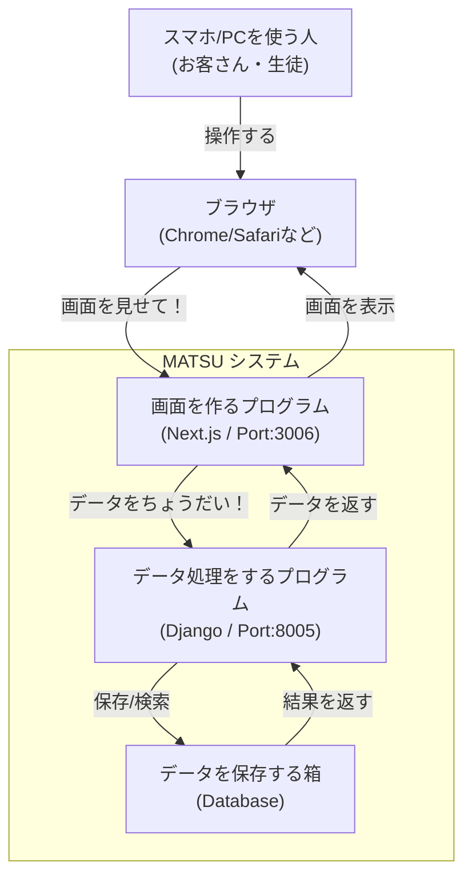
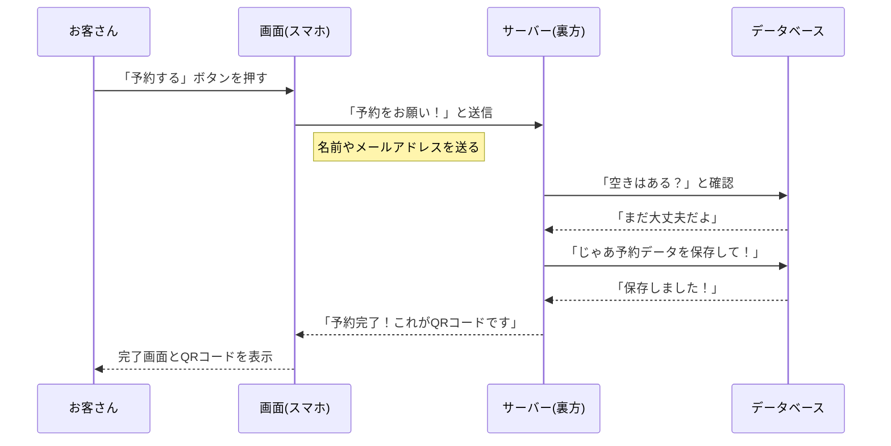
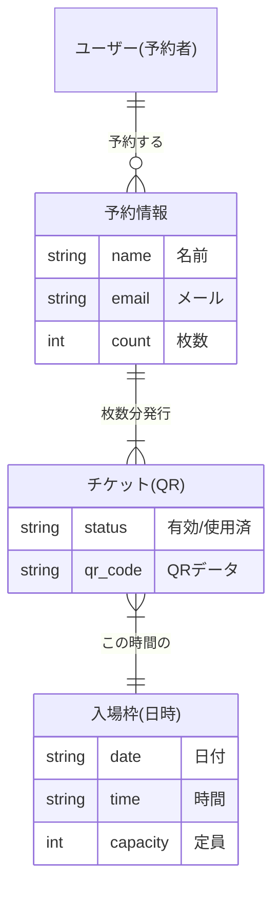

# MATSU システム開発・運用マニュアル

## 1. はじめに（このシステムについて）
このシステム「MATSU」は、文化祭のチケット予約と入場管理をデジタル化するものです。
紙のチケットの代わりに、スマホで予約して、QRコードで入場できるようにします。

**主な機能:**
*   **予約サイト**: お客さんがスマホからチケットを予約します。
*   **QRコード**: 予約完了時に発行され、入場の証になります。
*   **管理画面**: 運営委員が予約状況を見たり、当日の受付（QRスキャン）をしたりします。

## 2. システムの全体像（仕組み）
このシステムは、大きく分けて「**画面（フロントエンド）**」と「**裏方（バックエンド）**」の2つで動いています。



## 3. データの流れ（予約のしくみ）

予約が入ったとき、データはどう動くのかを図にしました。



## 4. 開発の始め方（プログラムの動かし方）

パソコンにこのシステムを入れて、動かすまでの手順です。
「ターミナル（黒い画面）」を使って操作します。

### 手順1: 準備
まず、このプログラムを自分のパソコンにコピーします（Git Clone）。
※ すでにコピー済みの場合はスキップしてください。

### 手順2: 起動する
一番簡単な方法は、用意されている「起動スクリプト」を使うことです。

1. ターミナルを開きます。
2. 以下のコマンド（命令）を入力してエンターキーを押します。

```bash
./start_system.sh
```

これだけで、自動的に準備をしてシステムが立ち上がります。
もし「許可がありません（Permission denied）」のようなエラーが出たら、以下を先に実行してください。

```bash
chmod +x start_system.sh
```

### 手順3: 画面を開く
起動に成功したら、ブラウザで以下のURLにアクセスしてください。

*   **予約画面（お客さん用）**: [http://localhost:3006](http://localhost:3006)
*   **管理画面（運営用）**: [http://localhost:3006/admin/dashboard](http://localhost:3006/admin/dashboard)
    *   ログインID: `admin`
    *   パスワード: `admin`

## 5. データ構造（どんなデータを扱っているか）

システムの中で管理しているデータの関係図です。



## 6. 困ったときは（トラブルシューティング）

### Q. 起動コマンドを打っても動かない！
A. すでに別のプログラムが動いているかもしれません。一度、以下のコマンドで強制終了させてみてください。

```bash
lsof -ti:3006,8005 | xargs kill -9
```
（これは「ポート3006と8005を使っているプログラムを強制停止せよ」という命令です）

### Q. 画面が真っ白になる / エラーが出る
A. プログラムの準備（インストール）がうまくいっていないかもしれません。
以下のコマンドで、一度リセットしてやり直せます。

```bash
# フロントエンド（画面）を作り直す
cd frontend
rm -rf node_modules
npm install
cd ..

# もう一度起動する
./start_system.sh
```

### Q. データを全部消して最初からやりたい
A. データベースファイルを削除すればリセットされます。

```bash
cd backend
rm db.sqlite3
python manage.py migrate
```

## 7. フォルダ構成（どこに何があるか）

```
.
├── backend/                # 裏方のプログラム (Django)
│   ├── api/                # ここに主な処理が書いてあります
│   └── db.sqlite3          # データベースファイル（ここにデータが入る）
├── frontend/               # 画面のプログラム (Next.js)
│   ├── app/                # ページごとのファイル
│   └── components/         # ボタンやフォームなどの部品
├── start_system.sh         # 起動するための便利ツール
├── CODE_EXPLANATION.md     # ★コードの詳細解説書（開発者向け）
└── DOCUMENTATION.md        # この説明書
```

## 8. コードの詳細について
プログラムの中身を詳しく知りたい場合は、新しく作成した **[CODE_EXPLANATION.md](CODE_EXPLANATION.md)** を参照してください。
各ファイルの役割や、重要なロジック（動的フォームや在庫管理の仕組みなど）について詳細に解説しています。
