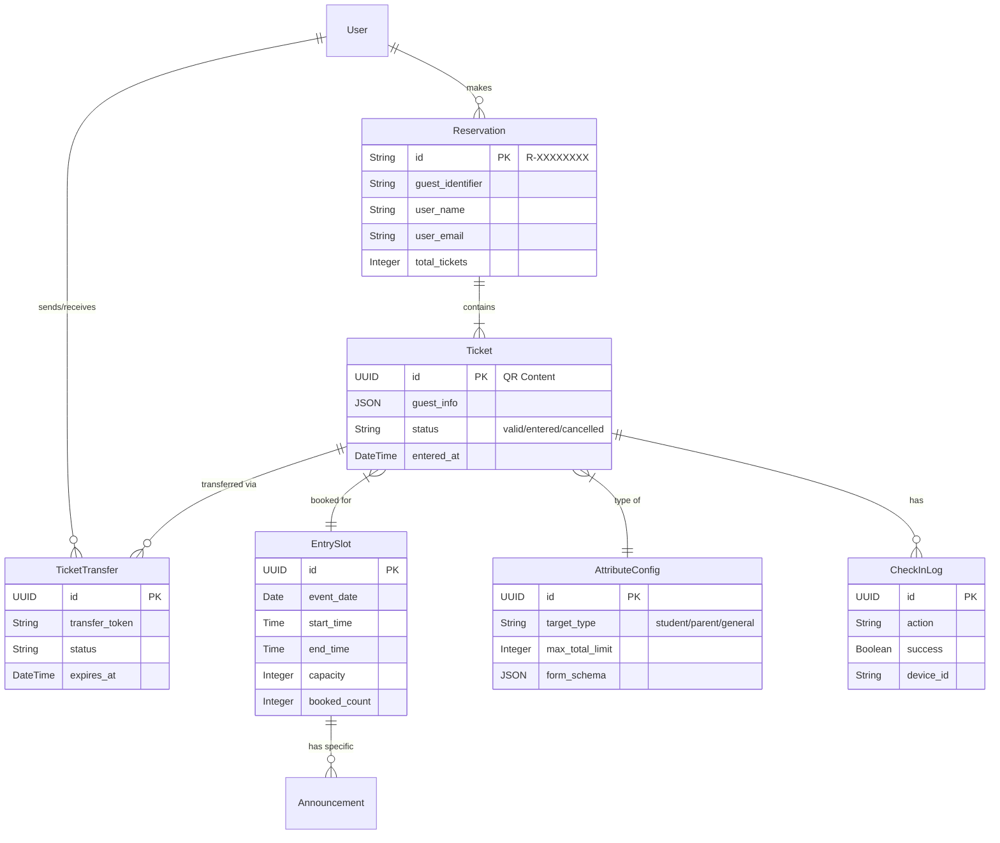
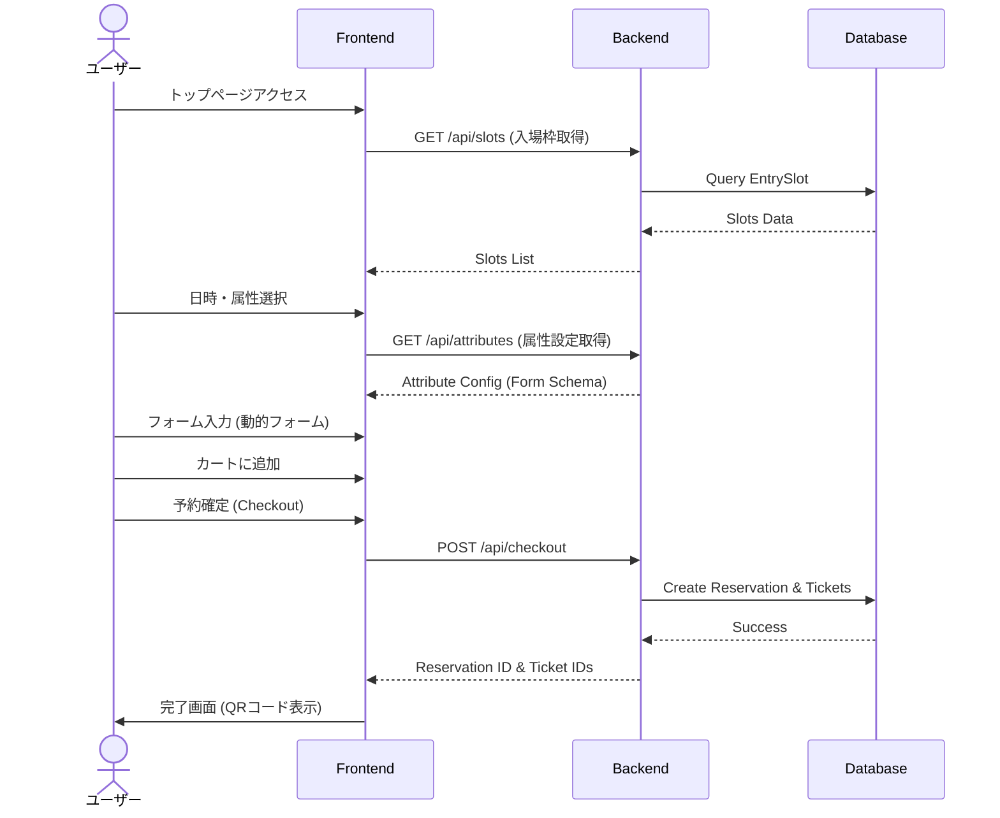

# MATSU プロジェクトドキュメント

## 1. プロジェクト概要
「MATSU」は洛星文化祭のための入場チケット予約・管理システムです。
属性ベースのクォータ管理（保護者、在校生、一般など）、動的フォームによる情報収集、QRコードを用いた当日の入場管理機能を提供します。

## 2. システムアーキテクチャ

```mermaid
graph TD
    User[ユーザー (ブラウザ)]
    Admin[管理者 (ブラウザ)]
    
    subgraph Frontend [Frontend (Next.js:3006)]
        Pages[App Router Pages]
        Components[UI Components]
        Store[Zustand Store]
        API_Client[API Client]
    end
    
    subgraph Backend [Backend (Django:8005)]
        API_Views[API Views (DRF)]
        Models[Django Models]
        Admin_Panel[Admin Panel (Unfold)]
        Auth[JWT Auth]
    end
    
    subgraph Database [Database]
        PostgreSQL[(PostgreSQL / SQLite)]
    end
    
    User -->|HTTPS| Pages
    Admin -->|HTTPS| Admin_Panel
    Pages --> Components
    Components --> Store
    Store --> API_Client
    API_Client -->|REST API| API_Views
    API_Views --> Models
    Models --> PostgreSQL
    Admin_Panel --> Models
```

## 3. データモデル (ER図)



## 4. ユーザーフロー

### チケット予約フロー



## 5. 環境構築と実行

### 必要要件
- Python 3.10+
- Node.js 18+
- npm

### 起動方法 (推奨)
プロジェクトルートにある起動スクリプトを使用するのが最も簡単です。

```bash
# 実行権限の付与（初回のみ）
chmod +x start_dev_new.sh

# 開発サーバーの起動
./start_dev_new.sh
```

このスクリプトは以下の処理を自動で行います：
1. ポート 3006, 8005 の競合プロセスを停止
2. バックエンドの仮想環境作成・依存関係インストール・マイグレーション・起動
3. フロントエンドの依存関係インストール・起動

### 手動起動の場合

**バックエンド (Port: 8005)**
```bash
cd backend
python3 -m venv venv
source venv/bin/activate
pip install -r requirements.txt
python manage.py migrate
python manage.py runserver 8005
```

**フロントエンド (Port: 3006)**
```bash
cd frontend-app
npm install
npm run dev -- -p 3006
```

## 6. アクセス情報

| サービス | URL | 備考 |
|---|---|---|
| **トップページ (予約)** | [http://localhost:3006](http://localhost:3006) | 一般ユーザー向け |
| **管理者ログイン** | [http://localhost:3006/auth/login](http://localhost:3006/auth/login) | ID: `admin` / PW: `admin` |
| **管理者ダッシュボード** | [http://localhost:3006/admin/dashboard](http://localhost:3006/admin/dashboard) | 統計・QRスキャン |
| **API ルート** | [http://localhost:8005/api](http://localhost:8005/api) | Swagger/ReDoc (もしあれば) |
| **Django 管理画面** | [http://localhost:8005/admin](http://localhost:8005/admin) | DB直接操作 |

## 7. ディレクトリ構造

```
.
├── backend/                # Django バックエンド
│   ├── api/                # アプリケーションロジック (Models, Views)
│   ├── core/               # 設定ファイル (settings.py)
│   └── manage.py           # 管理コマンド
├── frontend-app/           # Next.js フロントエンド
│   ├── app/                # ページコンポーネント (App Router)
│   ├── components/         # UIパーツ (shadcn/ui)
│   ├── lib/                # APIクライアント・型定義
│   └── store/              # 状態管理 (Zustand)
├── start_dev_new.sh        # 開発サーバー起動スクリプト
└── DOCUMENTATION.md        # 本ドキュメント
```

## 8. トラブルシューティング

### サーバーが起動しない / ポートが使われている
`start_dev_new.sh` を使用すれば自動的に競合プロセスを終了させますが、手動で解決する場合は以下のコマンドを実行してください。

```bash
lsof -ti:3006,8005 | xargs kill -9
```

### フロントエンドのビルドエラー
`node_modules` の不整合が原因の場合があります。以下を実行して再インストールしてください。

```bash
cd frontend-app
rm -rf node_modules package-lock.json
npm install
```

### データベースのリセット
開発データをリセットしたい場合は、`backend/db.sqlite3` を削除してマイグレーションを再実行してください。

```bash
cd backend
rm db.sqlite3
python manage.py migrate
# python manage.py create_sample_data  # (もしコマンドがあれば)
```
