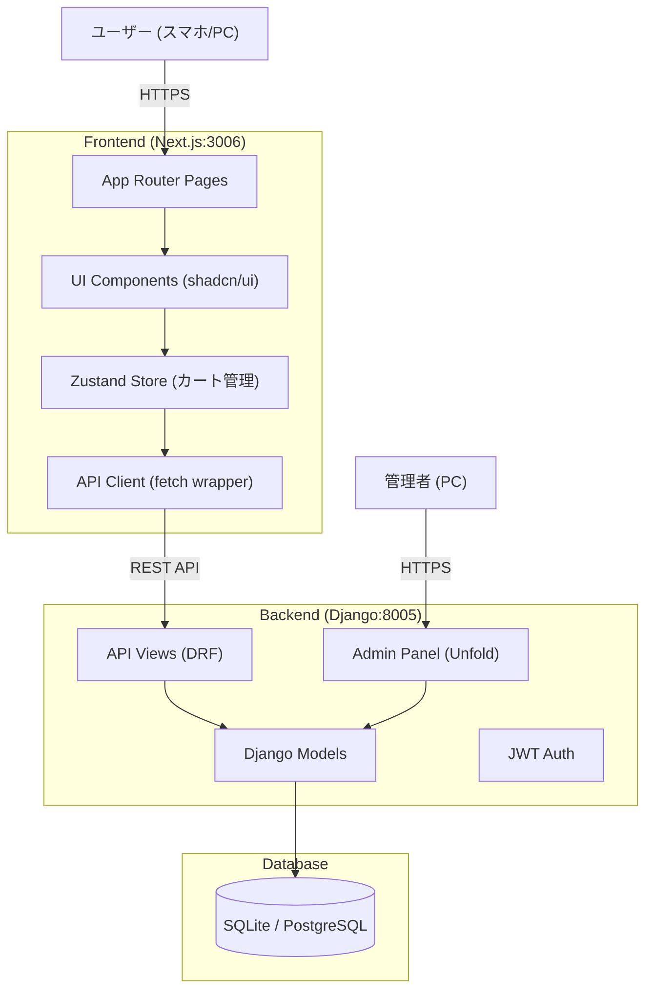
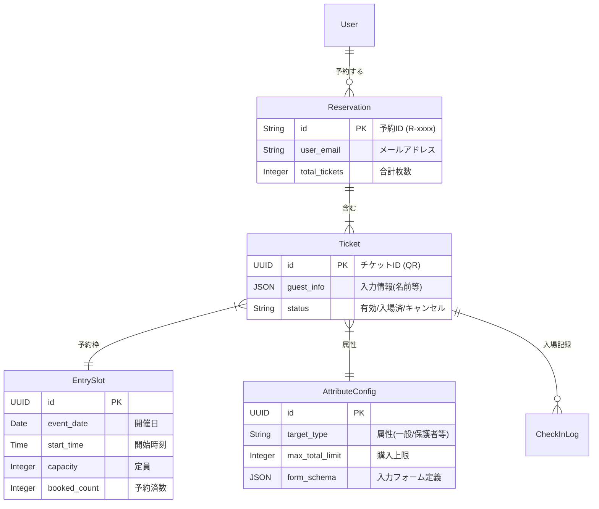
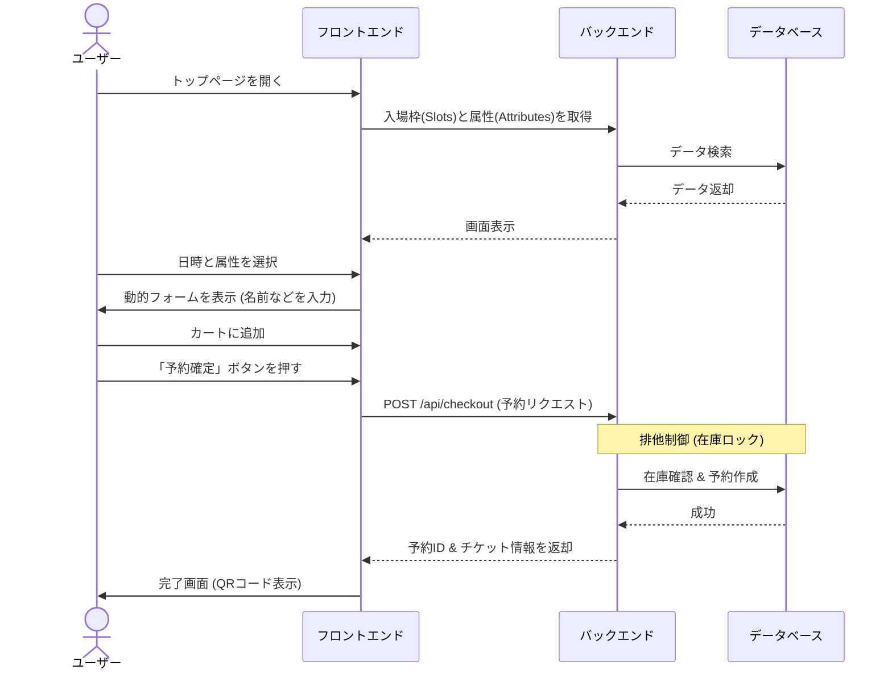

# MATSU - 洛星文化祭チケット予約・管理システム


「MATSU」は、洛星文化祭のために開発された、次世代の入場チケット予約・管理プラットフォームです。
従来の紙チケットやGoogleフォームでの管理から脱却し、**属性別の定員管理**、**動的な情報収集**、そして**QRコードによるスムーズな入場**を実現します。

---

## 📚 目次

1. [プロジェクト概要](#-プロジェクト概要)
2. [主な機能](#-主な機能)
3. [システムアーキテクチャ](#-システムアーキテクチャ)
4. [データモデル (ER図)](#-データモデル-er図)
5. [ユーザーフロー](#-ユーザーフロー)
6. [環境構築と起動](#-環境構築と起動)
7. [ディレクトリ構造](#-ディレクトリ構造)
8. [コード詳細解説](#-コード詳細解説)
9. [トラブルシューティング](#-トラブルシューティング)

---

## 🌟 プロジェクト概要

このシステムは、文化祭運営における以下の課題を解決するために設計されました。

*   **複雑な入場制限**: 「在校生の保護者は〇〇人まで」「一般は〇〇人まで」といった複雑なルールをシステムで自動制御します。
*   **情報の分散**: 予約データと当日の入場記録を一元管理し、リアルタイムで来場者数を把握できます。
*   **柔軟なフォーム**: 入場者の属性（中学生、保護者、OBなど）に応じて、入力してもらう項目（学年、クラス、緊急連絡先など）を自由に変更できます。

---

## 🚀 主な機能

| 機能 | 概要 |
|---|---|
| **チケット予約** | カレンダー形式で日時を選択し、カートに入れて一括予約できます。 |
| **属性別クォータ** | 「一般枠」「保護者枠」など、属性ごとに異なる在庫数を設定可能です。 |
| **動的フォーム** | 管理画面で設定したJSONスキーマに基づき、予約時の入力フォームを自動生成します。 |
| **QRチェックイン** | 発行されたQRコードをスマホで読み取るだけで、0.5秒で入場受付が完了します。 |
| **マイページ** | 予約したチケットの確認、QRコードの表示、キャンセルが可能です。 |
| **管理者ダッシュボード** | リアルタイムの予約数、入場数、売上（模擬店などへの拡張用）をグラフで確認できます。 |

---

## 🏗 システムアーキテクチャ

フロントエンドとバックエンドが分離されたモダンな構成です。



---

## 💾 データモデル (ER図)

システムの中核となるデータ構造です。



---

## 🔄 ユーザーフロー

ユーザーがサイトにアクセスしてから予約完了までの流れです。



---

## 💻 環境構築と起動

誰でも簡単に開発環境を立ち上げられるようにスクリプトを用意しています。

### 必要要件
*   **Node.js**: v18以上
*   **Python**: v3.10以上
*   **Git**

### クイックスタート (推奨)

ターミナルで以下のコマンドを実行するだけです。

```bash
# 1. リポジトリをクローン
git clone https://github.com/takumitakumiq/newness.git
cd newness

# 2. 実行権限を付与 (初回のみ)
chmod +x start_dev_new.sh

# 3. 起動スクリプトを実行
./start_dev_new.sh
```

このスクリプトは自動的に以下を行います：
1.  競合するポート(3006, 8005)のプロセスを停止
2.  Python仮想環境の作成と依存ライブラリのインストール
3.  データベースのマイグレーション
4.  Node.js依存ライブラリのインストール
5.  バックエンドとフロントエンドの同時起動

### アクセスURL

| 画面 | URL | ログイン情報 |
|---|---|---|
| **予約サイト** | [http://localhost:3006](http://localhost:3006) | - |
| **管理者ダッシュボード** | [http://localhost:3006/admin/dashboard](http://localhost:3006/admin/dashboard) | ID: `admin` / PW: `admin` |
| **Django管理画面** | [http://localhost:8005/admin](http://localhost:8005/admin) | ID: `admin` / PW: `admin` |

---

## 📂 ディレクトリ構造

```
.
├── backend/                # Django バックエンド
│   ├── api/                # アプリケーションロジック (Models, Views)
│   ├── core/               # プロジェクト設定 (settings.py)
│   ├── manage.py           # Django管理コマンド
│   └── requirements.txt    # Python依存ライブラリ
├── frontend-app/           # Next.js フロントエンド
│   ├── app/                # ページコンポーネント (App Router)
│   ├── components/         # UIパーツ (shadcn/ui)
│   ├── lib/                # APIクライアント・型定義
│   ├── store/              # 状態管理 (Zustand)
│   └── package.json        # Node.js依存ライブラリ
├── start_dev_new.sh        # 開発サーバー一発起動スクリプト
├── DOCUMENTATION.md        # 簡易ドキュメント
├── CODE_EXPLANATION.md     # 詳細コード解説書
└── README.md               # 本ファイル
```

---

## 📖 コード詳細解説

開発者向けに、各ファイルの役割や重要なロジックを解説します。

### 1. バックエンド (`backend/`)

*   **`api/models.py`**: データベースの設計図です。
    *   `EntrySlot`: 「10:00〜11:00」のような時間枠を定義します。`remaining` プロパティで残席数を計算します。
    *   `AttributeConfig`: 「保護者」「中学生」などの属性を定義します。`form_schema` フィールドにJSONを入れることで、フロントエンドの入力フォームを自由に変えられます。
*   **`api/views.py`**: サーバーの処理ロジックです。
    *   `CheckoutView`: 予約確定処理を行います。`select_for_update()` を使ってデータベースに行ロックをかけ、**ダブルブッキング（定員オーバー）を厳密に防いでいます**。

### 2. フロントエンド (`frontend-app/`)

*   **`store/useCartStore.ts`**: カートの中身を管理します。
    *   Zustandを使用し、ブラウザを閉じてもカートの中身が消えないようにしています。
    *   `addItem` 関数内で、属性ごとの購入上限チェックを行っています。
*   **`components/DynamicForm.tsx`**: 動的フォーム生成コンポーネントです。
    *   バックエンドから受け取ったJSONスキーマ（例: `{"type": "text", "label": "氏名"}`) を解析し、自動的に `<input>` タグを作ります。

---

## ❓ トラブルシューティング

### Q. 起動コマンドを打っても動かない
A. すでに別のプログラムがポートを使っている可能性があります。以下で強制終了できます。
```bash
lsof -ti:3006,8005 | xargs kill -9
```

### Q. 画面が真っ白になる / エラーが出る
A. `node_modules` の不整合が原因の場合があります。リセットしてみてください。
```bash
cd frontend-app
rm -rf node_modules package-lock.json
npm install
cd ..
./start_dev_new.sh
```

### Q. データベースをリセットしたい
A. 以下のコマンドで初期状態に戻せます。
```bash
cd backend
rm db.sqlite3
python manage.py migrate
```

---

Created by Takumi Yoshida for Rakusei Festival.
