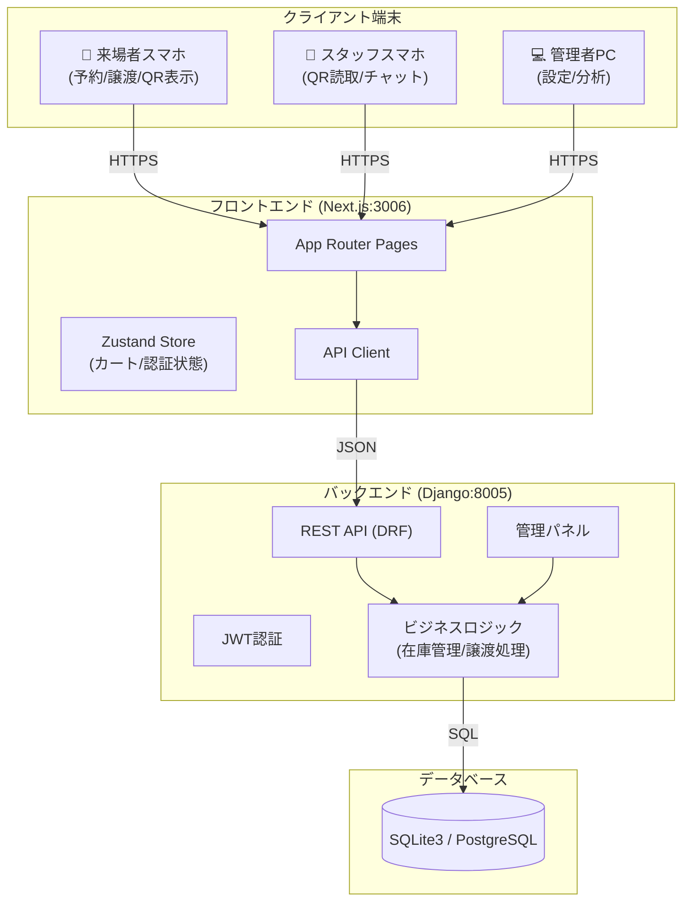
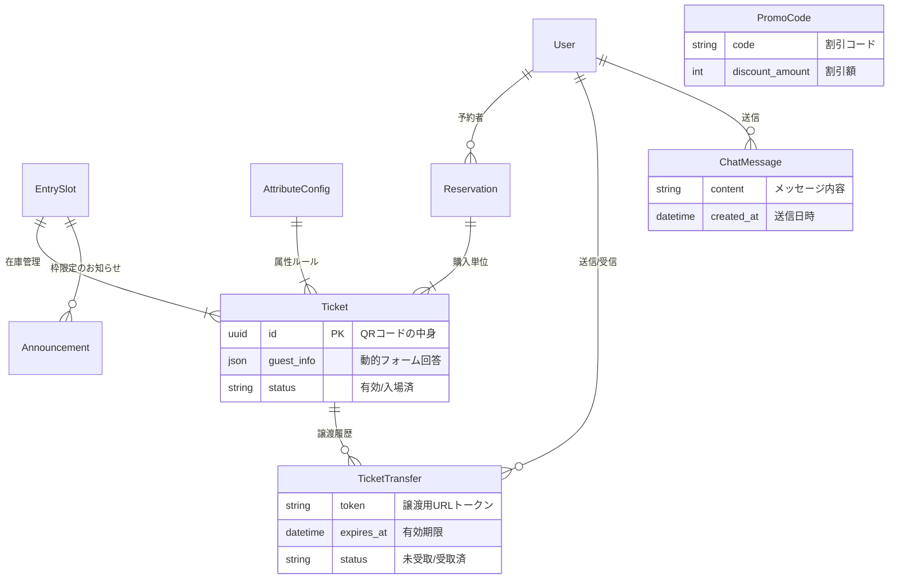
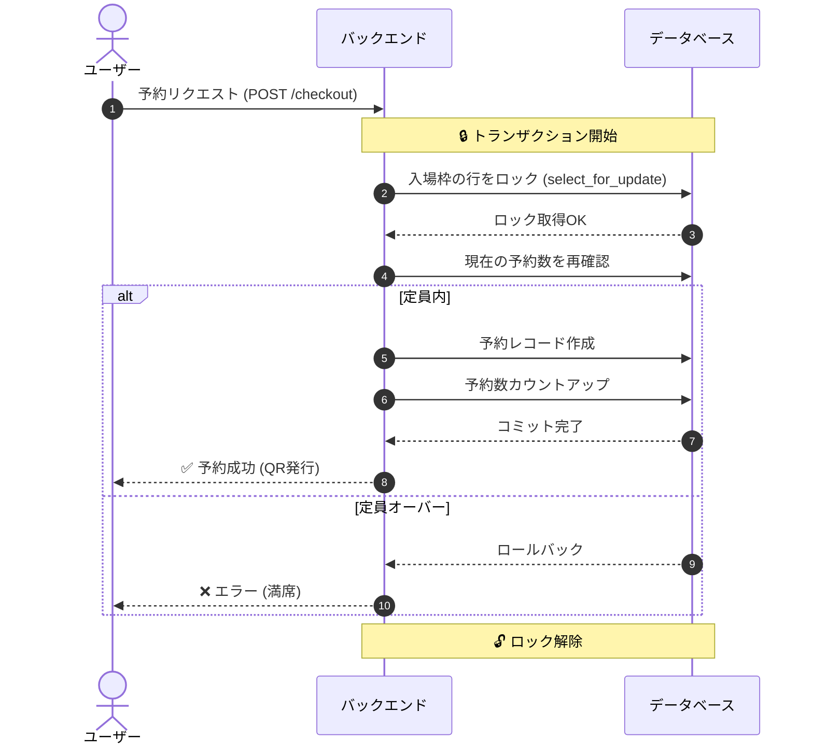
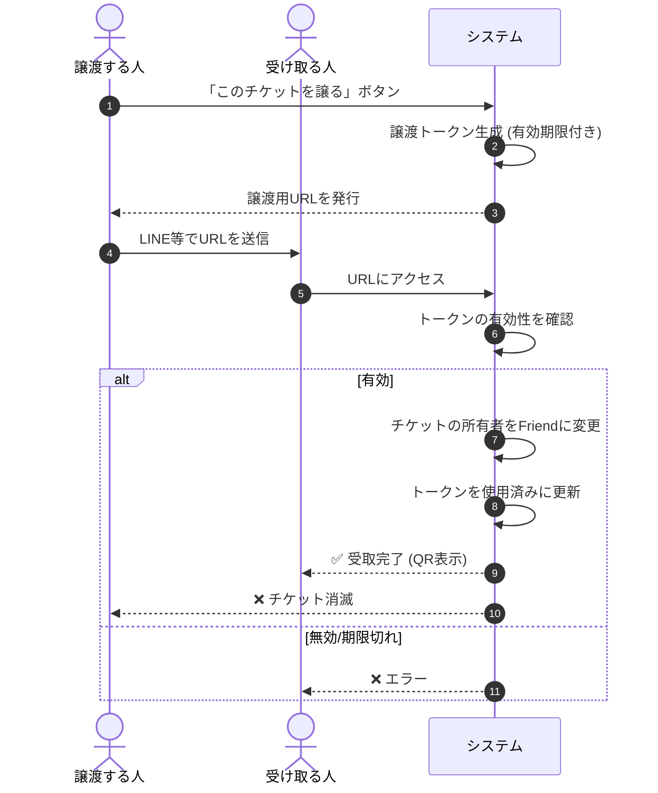

# 🎪 MATSU - 洛星文化祭チケット予約・管理システム


## 👋 次期開発者・運用担当者の方へ

このドキュメントは、**「システムの中身を全く知らない人が、今日から開発・運用を完全に引き継げるように」** という目的で書かれています。
単なる予約システムではなく、**譲渡機能**や**スタッフ間チャット**まで備えた統合プラットフォームです。まずはこの地図（README）で全体像を把握してください。

---

## 📚 目次

1. [システム概要（何ができるの？）](#-システム概要何ができるの)
2. [クイックスタート（まずは動かそう）](#-クイックスタートまずは動かそう)
3. [システム構成図（アーキテクチャ）](#-システム構成図アーキテクチャ)
4. [データベース設計（ER図）](#-データベース設計er図)
5. [重要な機能とデータの流れ](#-重要な機能とデータの流れ)
    - [1. 予約と排他制御](#1-予約と排他制御)
    - [2. チケット譲渡機能](#2-チケット譲渡機能)
6. [ディレクトリ構造](#-ディレクトリ構造)
7. [運用・メンテナンス](#-運用メンテナンス)

---

## 🌟 システム概要（何ができるの？）

**「MATSU」** は、文化祭運営のDX（デジタルトランスフォーメーション）を実現するフルスタックシステムです。

### 🎯 3つの主要ターゲットと機能

| ターゲット | 主な機能 |
|---|---|
| **一般来場者** | ✅ **チケット予約**: 属性（一般/保護者）ごとの定員管理<br>✅ **チケット譲渡**: 行けなくなったチケットを友人にLINE等で送付<br>✅ **マイページ**: QRコード表示、予約履歴確認 |
| **運営スタッフ** | ✅ **QRチェックイン**: スマホカメラで0.5秒入場受付<br>✅ **スタッフチャット**: トランシーバー代わりのリアルタイム連絡<br>✅ **リアルタイム監視**: 現在の入場者数をグラフで確認 |
| **システム管理者** | ✅ **動的フォーム**: 「中学生には学校名を聞く」等の設定を管理画面で変更<br>✅ **緊急お知らせ**: サイトトップに警告文を表示<br>✅ **システム管理**: DBバックアップ、ログ確認、キャッシュクリア |

---

## 🚀 クイックスタート（まずは動かそう）

複雑な環境構築は不要です。スクリプト一発で立ち上がります。

### 手順

1.  **ターミナルを開く**
2.  **以下のコマンドを実行**

```bash
# 実行権限を与える（初回のみ）
chmod +x start_system.sh

# システムを起動する
./start_system.sh
```

これだけで、バックエンド(Django)とフロントエンド(Next.js)が同時に起動します。

### アクセスURL

| 画面 | URL | ログイン情報 |
|---|---|---|
| **予約サイト** | [http://localhost:3006](http://localhost:3006) | (ユーザー登録して利用) |
| **スタッフ画面** | [http://localhost:3006/staff](http://localhost:3006/staff) | (スタッフ権限ユーザー) |
| **管理者ダッシュボード** | [http://localhost:3006/admin](http://localhost:3006/admin) | ID: `admin` / PW: `admin` |
| **Django管理画面** | [http://localhost:8005/admin](http://localhost:8005/admin) | ID: `admin` / PW: `admin` |

---

## 🤖 Copilotを使った開発（おすすめ運用）

このリポジトリは「引き継ぎ前提」なので、Copilotは **役割分割（サブエージェント運用）** で使うのがおすすめです。

- 運用フロー: [docs/COPILOT_WORKFLOW.md](docs/COPILOT_WORKFLOW.md)
- コピペ用プロンプト集: [docs/COPILOT_PROMPTS.md](docs/COPILOT_PROMPTS.md)

基本は次の順で進めます：

1. 仕様/PM（受け入れ条件ACを作る）
2. 調査（触るファイルを特定）
3. 実装（最小差分でパッチ）
4. テスト/レビュー（回帰潰し）

---

## 🏗 システム構成図（アーキテクチャ）



---

## 💾 データベース設計（ER図）

システムの中枢となるデータ構造です。**「予約」だけでなく「譲渡」「チャット」「お知らせ」も管理している**点に注目してください。



---

## 🔄 重要な機能とデータの流れ

### 1. 予約と排他制御
人気チケットの争奪戦でも**「定員オーバー（ダブルブッキング）」を絶対に起こさない**ための仕組みです。



### 2. チケット譲渡機能
「行けなくなったから友達にあげる」を実現する機能です。セキュリティのため、**一時的なトークン**を発行しています。



---

## 📂 ディレクトリ構造

開発に必要なファイルはここにあります。

```
.
├── backend/                # 🐍 バックエンド (Django)
│   ├── api/                # メインアプリ
│   │   ├── models.py       # ★DB定義 (一番重要)
│   │   ├── views.py        # ★ロジック (予約/譲渡/チャット)
│   │   └── urls.py         # URL設計図
│   ├── core/               # 設定 (settings.py)
│   └── db.sqlite3          # データベースファイル
│
├── frontend/               # ⚛️ フロントエンド (Next.js)
│   ├── app/                # 画面ファイル
│   │   ├── page.tsx        # トップページ
│   │   ├── staff/          # ★スタッフ用 (QRスキャン/チャット)
│   │   ├── transfer/       # ★譲渡受取ページ
│   │   └── admin/          # 管理者ダッシュボード
│   ├── components/         # UI部品
│   └── store/              # 状態管理 (Zustand)
│
└── start_system.sh         # 🚀 起動スクリプト
```

---

## 🛠 運用・メンテナンス

### 💬 スタッフチャットの使い方
スタッフ画面 (`/staff`) にアクセスすると、LINEのようなチャット画面があります。
トラブル発生時の全体共有や、各ゲート間の連絡に使用してください。

### 📢 緊急お知らせの出し方
1. [Django管理画面](http://localhost:8005/admin) > **Announcements**
2. 「ADD ANNOUNCEMENT」
3. `Priority` を `Critical` にすると、トップページに赤枠で警告が出ます（例：「台風のため中止」など）。

### 🎫 プロモーションコードの発行
1. [Django管理画面](http://localhost:8005/admin) > **Promo codes**
2. コード（例: `MATSU2025`）と割引額を設定。
3. ユーザーが予約時に入力すると割引が適用されます。

### 🆘 トラブルシューティング
**Q. サーバーが動かない / エラーが出る**
```bash
# プロセスを全停止して再起動
lsof -ti:3006,8005 | xargs kill -9
./start_system.sh
```

**Q. データを全消去してリセットしたい**
```bash
cd backend
rm db.sqlite3
python manage.py migrate
```

---

**Good luck! 最高の文化祭にしてください！**
Created by Takumi Yoshida.
