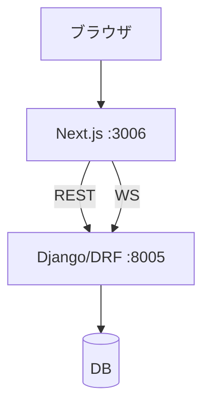

\# 🎪 MATSU - 洛星文化祭チケット予約・管理システム

MATSU は、文化祭の「チケット予約」「QRチェックイン」「スタッフチャット」「管理・監査」をまとめた運用システムです。
引き継ぎを前提に、起動手順・URL・運用ポイントをこの README に集約しています。

---

\## ✅ まず動かす（最短）

### 必須要件

- Node.js（推奨: LTS）
- Python 3

### 起動

```bash
chmod +x start_system.sh
./start_system.sh
```

`start_system.sh` は次を自動で行います。

- Python venv 作成/有効化（`./.venv`）
- Backend 依存のインストール + migrate
- Frontend 依存のインストール（`node_modules` が無い場合）
- Frontend の `NEXT_PUBLIC_API_URL` を `http://localhost:8005` に設定して起動

### ローカルURL（デフォルト）

| 種別 | URL | 備考 |
|---|---|---|
| 予約サイト（来場者） | http://localhost:3006 | ログイン/予約/マイページ |
| スタッフ画面 | http://localhost:3006/staff | スタッフ権限が必要 |
| 管理ダッシュボード（Next） | http://localhost:3006/admin | UI は Next 側 |
| Django 管理画面 | http://localhost:8005/admin | ID/PW: `admin` / `admin`（初期データがある場合） |
| Backend API | http://localhost:8005/api | REST の入口 |

---

\## 🧱 構成（アーキテクチャ）

- Frontend: Next.js (App Router) / Tailwind / Zustand
- Backend: Django / DRF / SimpleJWT / Channels
- DB: 開発は SQLite か PostgreSQL



---

\## 🌟 できること（現行仕様）

### 来場者

- 予約（入場枠 + 種別）・動的フォーム入力
- マイページでチケット（QR）表示、情報修正、キャンセル
- チケット単位の「閲覧専用共有リンク」を発行（期限付き）

### スタッフ

- QR チェックイン（単発/バッチ同期）
- 例外対応（手動チェックイン、取り消し）
- スタッフチャット（WebSocket + 既読/未読）

### 管理者

- 入場枠/属性/お知らせの管理
- 緊急停止・メンテナンス・購入停止などの運用切替
- 端末ID別の集計、監査ログ、バックアップ/ログ閲覧

---

\## 🔐 認証と接続先（重要）

### REST API

- ベース: `http(s)://<host>/api/...`
- Frontend は `NEXT_PUBLIC_API_URL` を参照して接続先を決めます。
  - 例: `NEXT_PUBLIC_API_URL=http://localhost:8005`

補足: `NEXT_PUBLIC_API_URL` が未設定でも、`/api/...` は Next の rewrite で `http://localhost:8005/api/...` に転送されます（開発用）。

### WebSocket（スタッフチャット）

- `ws(s)://<host>/ws/chat/?token=<JWT>`

---

\## 🧾 主要なデータ（ざっくり）

- `EntrySlot`: 入場枠（日時/定員/予約数）
- `AttributeConfig`: 種別（購入上限/動的フォーム定義）
- `Reservation`: 予約（購入のまとまり）
- `Ticket`: チケット（QR の中身、個別の来場者情報）

予約確定（Checkout）は DB 行ロック（`select_for_update`）で過剰販売を防止します。

---

\## 🔗 共有リンク（チケット閲覧専用）

現行仕様では「チケット譲渡（所有者変更）」は無効化しています。
代替として、チケットの閲覧専用リンク（期限付き）を発行できます。

- 共有ページ: `/share/[token]`
- Backend: `GET /api/shares/{token}/`（認証なし、閲覧のみ）

---

\## 📂 ディレクトリ構成

```
.
├── backend/                 # Django (API/管理)
│   ├── api/                 # 主要ロジック（models/serializers/views）
│   └── core/                # settings/urls/asgi
├── frontend/                # Next.js (来場者/スタッフ/管理UI)
│   ├── app/                 # ルーティング
│   ├── components/          # UI部品
│   ├── lib/                 # APIクライアント等
│   └── store/               # Zustand
├── start_system.sh          # 推奨: 統合起動スクリプト（3006/8005）
└── start_dev.sh             # 旧: 3000/8000（用途が明確な場合のみ）
```

補足: `newness-main/` は過去スナップショット/比較用です。通常はルート直下の `backend/` と `frontend/` を編集してください。

---

\## 🧪 開発（分けて起動したい場合）

### Backend

```bash
cd backend
python -m venv ../.venv
source ../.venv/bin/activate
pip install -r requirements.txt

# DBが無い/PGが無い場合（推奨）
export USE_SQLITE=1

python manage.py migrate
python manage.py runserver 0.0.0.0:8005
```

### Frontend

```bash
cd frontend
export NEXT_PUBLIC_API_URL="http://localhost:8005"
npm install
npm run dev -- -p 3006
```

---

\## 🧯 トラブルシューティング

### ポートが埋まって起動できない

```bash
lsof -ti:3006,8005 | xargs kill -9
```

### DB接続エラー（PostgreSQL が無い/接続できない）

開発は SQLite を使うのが最短です。

```bash
export USE_SQLITE=1
```

### Frontend で API に繋がらない

- `NEXT_PUBLIC_API_URL` が意図した値になっているか確認
- `start_system.sh` を使っている場合は自動設定されます

---

\## 🛡 運用上の注意（最低限）

- 重要操作（チェックイン/管理/緊急停止など）はサーバ側の `request.user` を唯一の操作者ソースにする
- 競合が起きうる処理（在庫・チェックイン等）は `transaction.atomic()` + `select_for_update()` + ロック後再検証
- トークンをブラウザ保存しているため、XSS 対策（入力の取り扱い・依存更新）を継続する

---

\## 📚 参考ドキュメント

- 仕様・受け入れ条件: `FEATURE_INSTRUCTION.md`
- 実装意図（コード解説）: `CODE_EXPLANATION.md`
- 運用マニュアル: `DOCUMENTATION.md`
- Copilot 運用: `docs/COPILOT_WORKFLOW.md`, `docs/COPILOT_PROMPTS.md`
    Friend->>System: URLにアクセス
    System->>System: トークンの有効性を確認
    
    alt 有効
        System->>System: チケットの所有者をFriendに変更
        System->>System: トークンを使用済みに更新
        System-->>Friend: ✅ 受取完了 (QR表示)
        System-->>Owner: ❌ チケット消滅
    else 無効/期限切れ
        System-->>Friend: ❌ エラー
    end
```

---

## 📂 ディレクトリ構造

開発に必要なファイルはここにあります。

```
.
├── backend/                # 🐍 バックエンド (Django)
│   ├── api/                # メインアプリ
│   │   ├── models.py       # ★DB定義 (一番重要)
│   │   ├── views.py        # ★ロジック (予約/譲渡/チャット)
│   │   └── urls.py         # URL設計図
│   ├── core/               # 設定 (settings.py)
│   └── db.sqlite3          # データベースファイル
│
├── frontend/               # ⚛️ フロントエンド (Next.js)
│   ├── app/                # 画面ファイル
│   │   ├── page.tsx        # トップページ
│   │   ├── staff/          # ★スタッフ用 (QRスキャン/チャット)
│   │   ├── transfer/       # ★譲渡受取ページ
│   │   └── admin/          # 管理者ダッシュボード
│   ├── components/         # UI部品
│   └── store/              # 状態管理 (Zustand)
│
└── start_system.sh         # 🚀 起動スクリプト
```

---

## 🛠 運用・メンテナンス

### 💬 スタッフチャットの使い方
スタッフ画面 (`/staff`) にアクセスすると、LINEのようなチャット画面があります。
トラブル発生時の全体共有や、各ゲート間の連絡に使用してください。

### 📢 緊急お知らせの出し方
1. [Django管理画面](http://localhost:8005/admin) > **Announcements**
2. 「ADD ANNOUNCEMENT」
3. `Priority` を `Critical` にすると、トップページに赤枠で警告が出ます（例：「台風のため中止」など）。

### 🎫 プロモーションコードの発行
1. [Django管理画面](http://localhost:8005/admin) > **Promo codes**
2. コード（例: `MATSU2025`）と割引額を設定。
3. ユーザーが予約時に入力すると割引が適用されます。

### 🆘 トラブルシューティング
**Q. サーバーが動かない / エラーが出る**
```bash
# プロセスを全停止して再起動
lsof -ti:3006,8005 | xargs kill -9
./start_system.sh
```

**Q. データを全消去してリセットしたい**
```bash
cd backend
rm db.sqlite3
python manage.py migrate
```

---

**Good luck! 最高の文化祭にしてください！**
Created by Takumi Yoshida.
