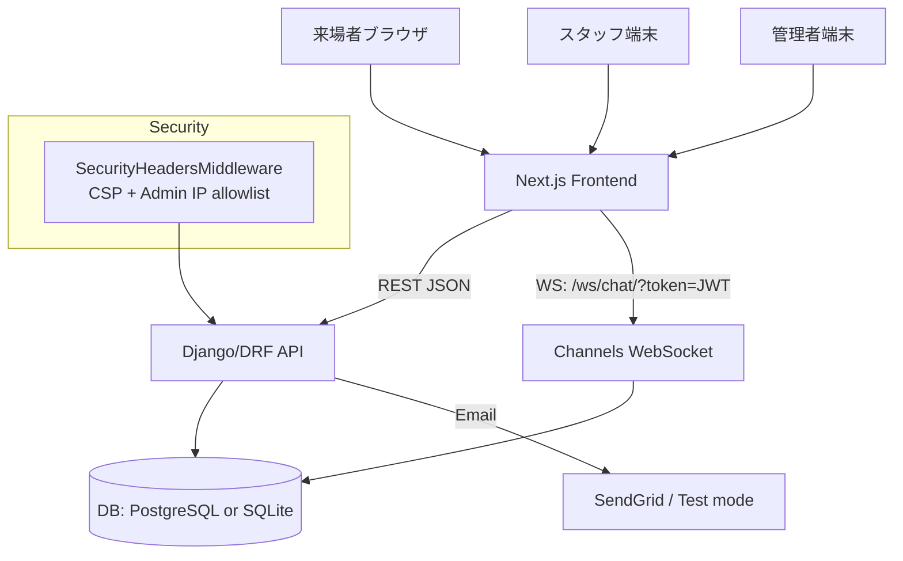
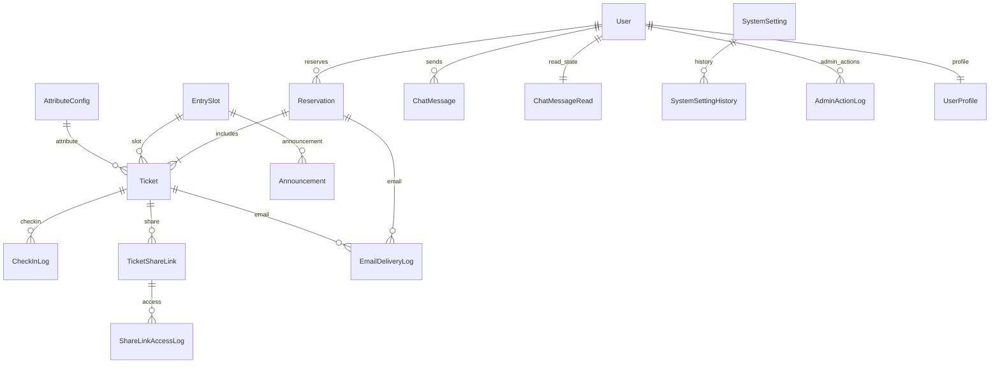
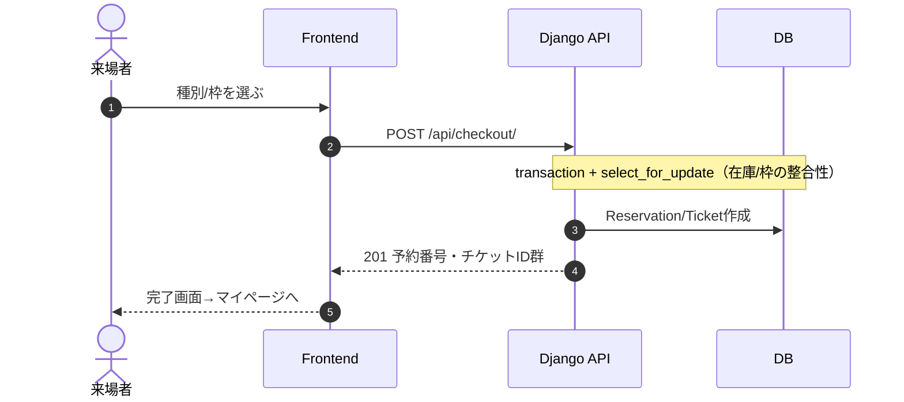
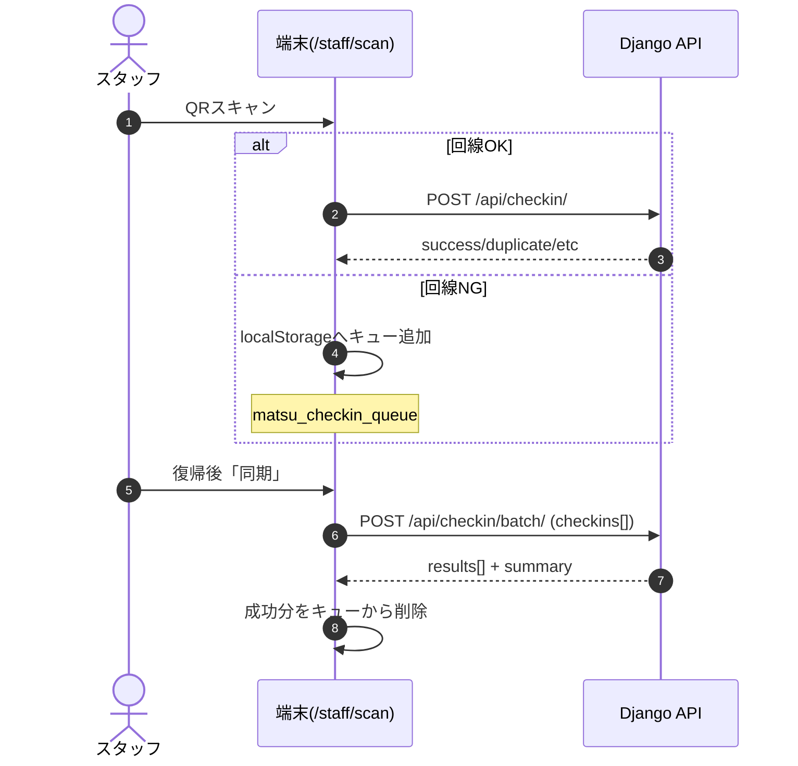
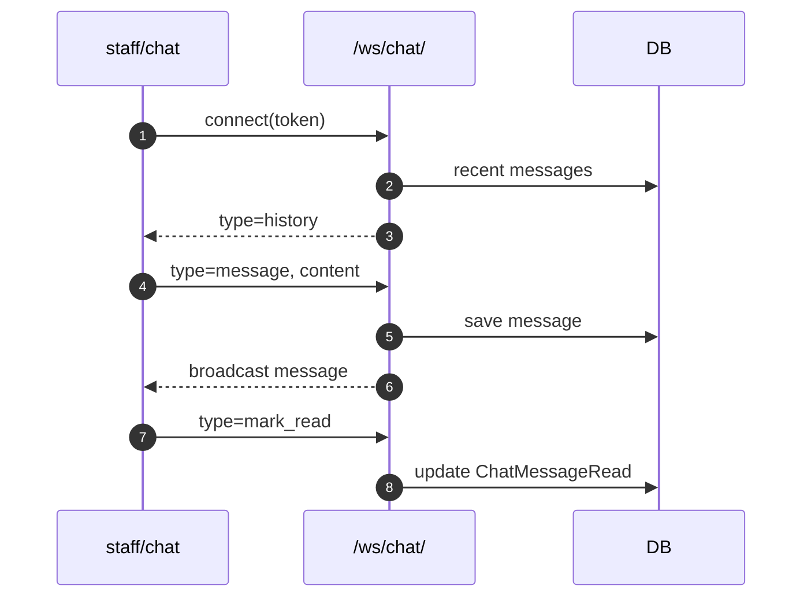

# MATSU 完全マニュアル（開発・運用・当日オペ）

作成日: 2026-01-19  
対象: 本リポジトリ（Django/DRF + Channels, Next.js App Router + TS）

このドキュメントは「引き継ぎ直後の人が、コードを読み込まずに運用・改修判断できる」レベルを目標に、実装（`backend/` と `frontend/`）を前提として整理した“完全マニュアル”です。

---

## 目次

- [1. システム概要](#1-システム概要)
- [2. 起動・セットアップ（開発/本番）](#2-起動セットアップ開発本番)
- [3. アーキテクチャ（全体構成）](#3-アーキテクチャ全体構成)
- [4. データモデル概要（ER）](#4-データモデル概要er)
- [5. 認証・権限・セキュリティ](#5-認証権限セキュリティ)
- [6. ユーザー機能（予約者）手順](#6-ユーザー機能予約者手順)
- [7. スタッフ機能（当日チェックイン/チャット）手順](#7-スタッフ機能当日チェックインチャット手順)
- [8. 管理者機能（運用/監査/サポート/一括）手順](#8-管理者機能運用監査サポート一括手順)
- [9. 運用モード・緊急停止（止め方/戻し方）](#9-運用モード緊急停止止め方戻し方)
- [10. 監視・ログ・監査（何がどこに残るか）](#10-監視ログ監査何がどこに残るか)
- [11. 本番投入チェックリスト](#11-本番投入チェックリスト)
- [12. トラブルシューティング](#12-トラブルシューティング)
- [付録A: API 一覧（URL早見表）](#付録a-api-一覧url早見表)

---

## 1. システム概要

MATSU は文化祭向けの「予約（購入）→ QR提示 → チェックイン（入場受付）」を中心に、スタッフチャット・管理者運用（バックアップ/ログ/緊急停止/監査/サポート/一括オペ）までを統合したシステムです。

### 1.1 役割（ロール）

| ロール | 主な画面 | 主な権限 | 目的 |
|---|---|---|---|
| 来場者（一般ユーザー） | `/` `/checkout` `/mypage` `/share/[token]` | 予約作成、自己チケット参照/編集/キャンセル、共有リンク作成 | 予約と当日の提示 |
| スタッフ（チェックイン端末） | `/staff/scan` `/staff/manual` `/staff/chat` | チェックイン、手動チェックイン、チャット | 当日入場オペ |
| 管理者（運用・監査） | `/admin/*` | 各種管理API（グループで細分化） | 当日の事故対応/集計/設定 |

> 注: 「チケット譲渡（Transfer）」はフロント側で無効化されています（`/transfer/[token]` は利用不可の案内を表示してトップへ戻します）。代替として「閲覧専用共有リンク（Share）」が提供されています。

---

## 2. 起動・セットアップ（開発/本番）

### 2.1 もっとも簡単な起動（推奨）

- ルートのスクリプトでバックエンド・フロントを同時起動します。

```bash
chmod +x start_system.sh
./start_system.sh
```

- 起動後の既定URL（`start_system.sh` のポート定義）
  - フロント: `http://localhost:3006`
  - バックエンドAPI: `http://localhost:8005/api`
  - Django管理画面: `http://localhost:8005/admin`

`start_system.sh` は `NEXT_PUBLIC_API_URL=http://localhost:8005` を自動で設定します。

### 2.2 もう一つの起動スクリプト（注意）

- `start_dev.sh` は `8000/3000` を使います。
- リポジトリ内には「3006/8005」「3000/8000」の2系統があるため、運用時は“どちらで立ち上げたか”を揃えてください。

### 2.3 バックエンド依存

- Python 仮想環境: `.venv/`
- 依存は `backend/requirements.txt`

### 2.4 フロントエンド依存

- `frontend/package.json` の `npm install`
- 実行時に `NEXT_PUBLIC_API_URL` が必須（未設定だと REST/WS とも接続先不明になりがち）

---

## 3. アーキテクチャ（全体構成）

### 3.1 構成図



### 3.2 重要な実装ポイント

- REST: `/api/...`（DRF）
- WebSocket: `/ws/chat/`（JWT必須）
- DB: `USE_SQLITE=true` の場合は SQLite、それ以外は PostgreSQL（`DB_*` env）
- 本番の Channels は Redis（`DEBUG=false` の時）

---

## 4. データモデル概要（ER）

実装の中核だけに絞った関係図です（詳細は `backend/api/models.py`）。



### 4.1 コアモデル（予約・在庫・入場）

- `EntrySlot`: 入場枠（定員・予約済み数・`entry_closed` で入場締切）
- `AttributeConfig`: 種別（購入上限、動的フォーム `form_schema`）
- `Reservation`: 予約（複数チケットの束）
- `Ticket`: チケット（QRの中身は `Ticket.id` UUID）
- `CheckInLog`: チェックイン監査（端末ID・操作者など）

### 4.2 運用・安全性モデル

- `SystemSetting`: 緊急停止/メンテ/運用モード/メール設定のシングルトン
- `SystemSettingHistory`: 設定変更履歴（ロールバック可能）
- `AdminActionLog`: 管理操作ログ（「誰が何をしたか」）

### 4.3 共有・メール・サポート

- `TicketShareLink`: チケットの閲覧専用リンク（期限/失効/最大アクセス回数/アクセスカウント）
- `ShareLinkAccessLog`: 共有リンクアクセスログ（IP/UA/成功可否）
- `EmailDeliveryLog`: メール送信ログ（テスト/本番、成功/失敗、紐付く予約/チケット）
- `UserProfile`: サポートメモ/本人確認ステータス

---

## 5. 認証・権限・セキュリティ

### 5.1 認証（JWT）

- ログイン: `/api/auth/login/`（SimpleJWT）
- フロントは `access_token`/`refresh_token` を localStorage に保存し、以後 `Authorization: Bearer <token>` を付与します（`frontend/lib/api.ts`）。

### 5.2 権限の考え方（重要）

- DRFの `IsAdminUser` に加えて、管理系は「グループ」で機能を分割しています。
- 代表グループ（`backend/api/migrations/0011_create_admin_groups.py` と `0013_admin_features.py`）

| グループ名 | 代表的な用途 |
|---|---|
| `admin_read` | 閲覧系（統計、ヘルス、ログ閲覧など） |
| `admin_ops` | 運用操作（バックアップ作成、クリーンアップ実行、ユーザー編集等） |
| `admin_emergency` | 緊急停止の切替、設定ロールバック等 |
| `admin_audit` | 監査ログ検索/CSV出力 |
| `admin_support` | サポート検索/対応操作 |
| `admin_bulk` | 一括オペ（入場締切、枠移動等） |

> UI 側は「`user.is_staff` かどうか」を主に見ており、細かなグループ不足は API の 403 で弾かれます（運用上は“管理者UIに入れたのに操作できない”状態が起きうるので、グループ付与が重要です）。

### 5.3 Admin IP allowlist（任意）

- `ADMIN_ALLOWED_IPS`（例: `1.2.3.4,5.6.7.8`）を設定すると、`/admin` と `/api/admin` をそのIP以外からアクセス禁止にします（`backend/api/security_middleware.py`）。
- リバースプロキシ配下では `X-Forwarded-For` の先頭をクライアントIPとして扱います。

### 5.4 セキュリティヘッダ/CSP

- `SecurityHeadersMiddleware` が `X-Frame-Options: DENY` 等と CSP を付与します。
- CSP は `connect-src` に `ws: wss:` を含むため、チャットWebSocketがブロックされにくい設定です。

---

## 6. ユーザー機能（予約者）手順

### 6.1 ログイン/登録

- 未ログイン時、トップ `/` は認証フォームを表示します。
- API:
  - 登録: `POST /api/auth/register/`
  - ログイン: `POST /api/auth/login/`
  - 自分: `GET/PATCH /api/auth/me/`

### 6.2 予約（購入）

- 画面: `/` → カート → `/checkout`
- API: `POST /api/checkout/`

予約処理は「在庫超過（ダブルブッキング）」を防ぐ前提で実装されています（トランザクションとロックは serializer 側の `save()` に閉じている設計）。



- 予約完了メール: `reservation.user_email` があれば送信（失敗しても購入自体は成功扱い）

### 6.3 マイページ（チケット表示/編集/キャンセル/共有）

- 画面: `/mypage`
- API:
  - 自分のチケット: `GET /api/mypage/tickets/`
  - チケット編集: `PATCH /api/tickets/<ticket_id>/update_info/`
  - チケットキャンセル: `POST /api/tickets/<ticket_id>/cancel/`
  - 共有リンク作成: `POST /api/shares/create/`
  - 共有リンク失効: `POST /api/shares/revoke/`

オフライン時は localStorage のキャッシュを表示できるようになっています（`matsu_tickets_cache`）。

### 6.4 Apple Wallet（PKPass）

- API: `GET /api/mypage/wallet-pass/<ticket_uuid>/`
- 必要環境変数（未設定の場合は 501 を返す）:
  - `PASSKIT_TEAM_ID`
  - `PASSKIT_PASS_TYPE_ID`
  - `PASSKIT_ORG_NAME`
  - `PASSKIT_CERT_PATH`
  - `PASSKIT_KEY_PATH`
  - `PASSKIT_WWDR_CERT_PATH`

---

## 7. スタッフ機能（当日チェックイン/チャット）手順

### 7.1 チェックイン（スキャン）

- 画面: `/staff/scan`
- API:
  - 単発チェックイン: `POST /api/checkin/`
  - バッチ同期: `POST /api/checkin/batch/`
  - 緊急停止ポーリング: `GET /api/emergency-status/`（認証不要）

#### 7.1.1 オンライン時の通常動作

- QR を読み取る（または手入力）→ `/api/checkin/` に投げる
- 5秒以内の二重スキャンは端末側で抑止（Mapキャッシュ）

#### 7.1.2 オフライン/不安定回線の運用（重要）

- 通信失敗時、端末は `matsu_checkin_queue` に `{ticket_uuid, device_id, scanned_at}` を保存
- 復帰後に「同期」ボタンで `/api/checkin/batch/` にまとめて送信



#### 7.1.3 サーバ側ブロック条件

- `SystemSetting` によるブロック（後述）
- `EntrySlot.entry_closed=true` はチェックイン拒否（423相当）
- Ticket状態:
  - `entered`: 既に入場済み（409）
  - `cancelled`: 無効（410）

### 7.2 手動チェックイン（例外処理）

- 画面: `/staff/manual`
- API: `GET/POST /api/admin/manual-checkin/`
  - `GET`: 名前/メール等で検索
  - `POST`: チケットID指定で入場処理

### 7.3 スタッフチャット

- 画面: `/staff/chat`
- REST:
  - `GET /api/chat/messages/`（過去ログ取得、ヘッダで `X-Has-More` 等）
  - `POST /api/chat/messages/`（送信）
  - `GET/POST /api/chat/unread/`（未読数/既読化）
- WebSocket:
  - `ws(s)://<host>/ws/chat/?token=<JWT>`



---

## 8. 管理者機能（運用/監査/サポート/一括）手順

### 8.1 管理画面の入口

- 画面: `/admin`（Next.js 側の管理UI）
  - 認証は通常ログイン（JWT）で行い、`user.is_staff` が必要
- Django 管理サイト: `http://<backend>/admin`（Django側、Unfold採用）

### 8.2 ダッシュボード/統計

- 画面: `/admin/dashboard`
- API: `GET /api/admin/statistics/`
- 主な指標:
  - 予約/チケット数、入場率、キャンセル数
  - チェックイン失敗率、メール失敗率
  - 管理操作件数、共有リンク閲覧数
  - 異常検知（簡易）: 共有リンクスパイク、重複チェックイン

### 8.3 システム管理（運用タブ群）

- 画面: `/admin/system`
- API:
  - ヘルス: `GET /api/admin/system/health/`
  - バックアップ: `GET/POST /api/admin/system/backup/`
  - ログ: `GET /api/admin/system/logs/`
  - クリーンアップ: `GET/POST /api/admin/system/cleanup/`
  - キャッシュ: `POST /api/admin/system/cache/`
  - ユーザー管理: `GET/POST /api/admin/system/users/`
  - エクスポート: `GET /api/admin/system/export/`
  - 緊急停止/運用モード: `GET/POST /api/admin/emergency/`
  - メール設定/テスト: `GET/POST /api/admin/email-settings/`, `POST /api/admin/email-test/`
  - 設定履歴/ロールバック: `GET /api/admin/system/settings/history/`, `POST /api/admin/system/settings/rollback/`

### 8.4 監査ログ（横断検索/CSV）

- 画面: `/admin/audit`
- API:
  - `GET /api/admin/audit/search/`
  - `GET /api/admin/audit/export/`

対象ログ:
- 管理操作（`AdminActionLog`）
- チェックイン（`CheckInLog`）
- メール（`EmailDeliveryLog`）
- 共有リンクアクセス（`ShareLinkAccessLog`）

### 8.5 顧客サポート（検索/対応）

- 画面: `/admin/support`
- API:
  - 検索: `GET /api/admin/support/search/?q=...`
  - 対応: `POST /api/admin/support/action/`

対応アクション例:
- `resend_confirmation`: 予約確認メール再送
- `revoke_share`: 共有リンク失効（サポート側）
- `update_note`: サポートメモ更新
- `update_verification`: 本人確認更新

### 8.6 一括オペ（当日の事故対応用）

- 画面: `/admin/bulk`
- API: `POST /api/admin/bulk/`

実行できること:
- 入場締切: `close_entry` / `open_entry`
- 一括チェックイン取り消し: `checkin_revert`（枠単位で entered→valid）
- 枠移動: `move_slot`（移動先残枠チェックあり）
- 一括リマインドメール: `reminder_email`

### 8.7 管理画面（Next.js）ページ対応表（画面→API→必要グループ）

フロントの管理UIは「`user.is_staff`」で入口制御しますが、**実際の操作可否はAPI側のグループ判定（403）**で決まります。

| 画面 | ルート | 主に叩くAPI | 必要条件（API側） |
|---|---|---|---|
| ダッシュボード | `/admin/dashboard` | `GET /api/admin/statistics/` | `IsAdminUser` + `admin_read` |
| 統計 | `/admin/statistics` | `GET /api/admin/statistics/` | `IsAdminUser` + `admin_read` |
| 監査ログ | `/admin/audit` | `GET /api/admin/audit/search/` / `GET /api/admin/audit/export/` | `IsAdminUser` + (`admin_read` **または** `admin_audit`) |
| 顧客サポート | `/admin/support` | `GET /api/admin/support/search/` | `IsAdminUser` + (`admin_read` **または** `admin_support`) |
| サポート操作 | `/admin/support` | `POST /api/admin/support/action/` | `IsAdminUser` + (`admin_support` **または** `admin_ops`) |
| 一括オペ | `/admin/bulk` | `POST /api/admin/bulk/` | `IsAdminUser` + (`admin_bulk` **または** `admin_ops`) |
| システム管理（閲覧） | `/admin/system` | `GET /api/admin/system/health/` `GET /api/admin/system/backup/` `GET /api/admin/system/logs/` `GET /api/admin/system/cleanup/` `GET /api/admin/system/users/` `GET /api/admin/system/settings/history/` `GET /api/admin/emergency/` `GET /api/admin/email-settings/` | それぞれ `IsAdminUser` +（多くが）`admin_read`。設定履歴は (`admin_read`/`admin_audit`/`admin_ops`) のいずれか |
| システム管理（更新系） | `/admin/system` | `POST /api/admin/system/backup/` `DELETE /api/admin/system/backup/` `POST /api/admin/system/cleanup/` `POST /api/admin/system/cache/` `PATCH/DELETE /api/admin/system/users/` `GET /api/admin/system/export/` `POST /api/admin/email-settings/` `POST /api/admin/email-test/` | `IsAdminUser` + `admin_ops`（ユーザーの staff/superuser 変更やPWリセットは実質 superuser 必須） |
| 緊急停止/運用モード更新 | `/admin/system` | `POST /api/admin/emergency/` | `IsAdminUser` + `admin_emergency` |
| 設定ロールバック | `/admin/system` | `POST /api/admin/system/settings/rollback/` | `IsAdminUser` + (`admin_emergency` **または** `admin_ops`) |
| 来場者・チケット | `/admin/visitors` | `GET/PATCH/DELETE /api/reservations/...` `GET/PATCH /api/tickets/...` | `IsAdminUser`（グループ判定なし） |
| 時間枠 | `/admin/slots` | `GET /api/slots/`（一覧は公開） + `POST/PATCH/DELETE /api/slots/...` | 変更系は `IsAdminUser` |
| 種別・フォーム | `/admin/attributes` | `GET /api/attributes/`（一覧は公開） + `POST/PATCH/DELETE /api/attributes/...` | 変更系は `IsAdminUser` |
| お知らせ | `/admin/announcements` | `GET /api/announcements/`（一覧は公開） + `POST/PATCH/DELETE /api/announcements/...` | 変更系は `IsAdminUser` |

補足:
- superuser はグループチェックをバイパスします（=グループ未付与でも通ります）。
- 「管理UIに入れるのに操作できない」はグループ不足が典型です（403が返る）。

---

## 9. 運用モード・緊急停止（止め方/戻し方）

`SystemSetting` が全体挙動を制御します。

### 9.1 フラグ一覧

| 設定 | 意味 | 影響（バックエンド実装に準拠） |
|---|---|---|
| `emergency_stop` | 緊急停止 | **チェックイン停止**（423）。`emergency_message` があればそれを返す |
| `maintenance_mode` | メンテ中 | **購入停止**（503）+ **チェックイン停止**（503） |
| `operation_mode` | 運用モード | 値によって購入/チェックインを制御（下表） |
| `EntrySlot.entry_closed` | 枠単位の入場締切 | その枠の **チェックイン停止**（423） |

#### 9.1.1 `operation_mode` の値と挙動

| 値 | 日本語 | 購入（/api/checkout） | チェックイン（/api/checkin） |
|---|---|---|---|
| `normal` | 通常 | 可能 | 可能 |
| `read_only` | 読み取り専用 | 停止（423） | 停止（423） |
| `purchase_stop` | 購入停止 | 停止（423） | 可能 |
| `checkin_only` | チェックイン専用 | 停止（423） | 可能 |

### 9.2 推奨運用（当日）

- 受付トラブル（スキャン端末が暴走等）: まず `operation_mode=read_only` または `emergency_stop=true` で一旦止血
- 一部枠だけ止めたい: `EntrySlot.entry_closed=true`（一括オペで操作可）
- 復旧: 設定を戻す or 設定履歴からロールバック

---

## 10. 監視・ログ・監査（何がどこに残るか）

### 10.1 DBに残る主要ログ

| 種別 | モデル | 何が残る |
|---|---|---|
| チェックイン | `CheckInLog` | 成功/失敗、端末ID、操作者、メッセージ |
| 管理操作 | `AdminActionLog` | アクション、対象、actor、before/after など |
| メール | `EmailDeliveryLog` | 宛先、件名、テスト/本番、成功可否、プロバイダ応答 |
| 共有リンク | `ShareLinkAccessLog` | IP、UA、成功可否、メッセージ |
| 設定履歴 | `SystemSettingHistory` | スナップショット（APIキーは表示時マスク） |

### 10.2 監査の見方

- `/admin/audit` で横断検索
- CSVでオフライン共有・提出（監査・報告に便利）

---

## 11. 本番投入チェックリスト

### 11.1 必須（最低限）

- `DEBUG=false`
- `DJANGO_SECRET_KEY` を強固に
- `ALLOWED_HOSTS` を適切に
- DB: Postgres 推奨（`DB_*`） or `USE_SQLITE=true`（小規模/単体運用）
- CORS: `CORS_ALLOWED_ORIGINS` を本番フロントURLに合わせる
- `NEXT_PUBLIC_API_URL` を本番APIに合わせる

### 11.2 推奨（安全性/安定性）

- Channels: `DEBUG=false` の場合 Redis を用意（`REDIS_HOST/REDIS_PORT`）
- `ADMIN_ALLOWED_IPS` で管理画面の到達面積を削減
- メール:
  - `SystemSetting.email_mode=production`
  - SendGrid API Key 設定
  - `sendgrid` Python パッケージが入っていること

### 11.3 Apple Wallet を使う場合

- PASSKIT系 env を全て揃える
- 証明書/鍵ファイルの配置と権限

---

## 12. トラブルシューティング

### 12.1 管理画面で 403（Permission denied）

- `user.is_staff` は満たしているが、グループが足りないケースが多いです。
- 対応: ユーザーに `admin_read/admin_ops/admin_emergency/...` を付与

### 12.2 チェックインが 423/503 で止まる

- 423: `emergency_stop` または `operation_mode=read_only`、または枠の `entry_closed` が原因
- 503: `maintenance_mode` が原因
- 対応: `/admin/system` の「緊急停止/運用モード」を確認し、必要なら履歴からロールバック

### 12.3 スタッフ端末がオフラインで詰まった

- `/staff/scan` のキュー（`matsu_checkin_queue`）が溜まっている可能性
- 回線復帰後に同期（`/api/checkin/batch/`）

### 12.4 チャットが繋がらない

- `NEXT_PUBLIC_API_URL` が誤っていると WS も死にます
- 本番では `wss://` とリバースプロキシ設定（Upgradeヘッダ）が必要
- CSP は `ws: wss:` を許可済み（ただし独自CSP上書きに注意）

### 12.5 メールが送れない

- `email_mode=test` だと「成功扱いでログのみ」
- `production` で失敗する場合:
  - SendGrid APIキー未設定
  - `sendgrid` パッケージ未インストール
  - 送信元アドレス未認証（SendGrid側）

---

## 付録A: API 一覧（URL早見表）

> 末尾 `/` はフロント側ラッパーが自動補正します（`frontend/lib/api.ts`）。

### 公開/一般

| Method | Path | 説明 | 認証 |
|---|---|---|---|
| GET | `/api/health/` | ヘルス | 不要 |
| GET | `/api/slots/` | 枠一覧 | 不要（一般はactiveのみ） |
| GET | `/api/attributes/` | 種別/フォーム一覧 | 不要（一般はactiveのみ） |
| GET | `/api/announcements/` | お知らせ一覧 | 不要（一般はactiveのみ） |
| GET | `/api/emergency-status/` | 緊急停止/メンテ状態 | 不要 |
| GET | `/api/shares/<token>/` | 共有チケット閲覧 | 不要（レート制限あり） |

### 認証（JWT）

| Method | Path | 説明 |
|---|---|---|
| POST | `/api/auth/register/` | 登録 |
| POST | `/api/auth/login/` | ログイン（access/refresh） |
| POST | `/api/auth/refresh/` | 更新 |
| POST | `/api/auth/logout/` | ログアウト（blacklist） |
| GET/PATCH | `/api/auth/me/` | 自分 |

### 予約者（ログイン必須）

| Method | Path | 説明 |
|---|---|---|
| POST | `/api/checkout/` | 購入 |
| GET | `/api/mypage/reservations/` | 自分の予約 |
| GET | `/api/mypage/tickets/` | 自分のチケット |
| GET | `/api/mypage/wallet-pass/<ticket_uuid>/` | pkpass |
| PATCH | `/api/tickets/<ticket_uuid>/update_info/` | チケット情報更新 |
| POST | `/api/tickets/<ticket_uuid>/cancel/` | キャンセル |
| POST | `/api/shares/create/` | 共有リンク作成 |
| POST | `/api/shares/revoke/` | 共有リンク失効 |

### スタッフ/管理者（IsAdminUser + グループ）

| Method | Path | 説明 |
|---|---|---|
| POST | `/api/checkin/` | チェックイン |
| POST | `/api/checkin/batch/` | バッチチェックイン |
| POST | `/api/admin/checkin/revert/` | 入場取消 |
| GET | `/api/admin/statistics/` | 統計 |
| GET/POST | `/api/admin/manual-checkin/` | 手動チェックイン |
| GET | `/api/admin/realtime-monitor/` | 入場状況モニタ |
| GET/POST | `/api/admin/emergency/` | 緊急停止/運用モード |
| GET | `/api/admin/device-stats/` | 端末集計 |

### システム運用

| Method | Path | 説明 |
|---|---|---|
| GET | `/api/admin/system/health/` | ヘルス詳細 |
| GET/POST | `/api/admin/system/backup/` | バックアップ一覧/作成 |
| GET | `/api/admin/system/logs/` | ログ閲覧 |
| GET/POST | `/api/admin/system/cleanup/` | クリーンアップ |
| POST | `/api/admin/system/cache/` | キャッシュ操作 |
| GET/POST | `/api/admin/system/users/` | ユーザー管理 |
| GET | `/api/admin/system/export/` | データエクスポート |
| GET | `/api/admin/system/settings/history/` | 設定履歴 |
| POST | `/api/admin/system/settings/rollback/` | ロールバック |

### 監査/サポート/一括

| Method | Path | 説明 |
|---|---|---|
| GET | `/api/admin/audit/search/` | 監査検索 |
| GET | `/api/admin/audit/export/` | 監査CSV |
| GET | `/api/admin/support/search/` | サポート検索 |
| POST | `/api/admin/support/action/` | サポート操作 |
| POST | `/api/admin/bulk/` | 一括オペ |

### メール設定

| Method | Path | 説明 |
|---|---|---|
| GET/POST | `/api/admin/email-settings/` | メール設定 |
| POST | `/api/admin/email-test/` | テスト送信（レート制限） |
